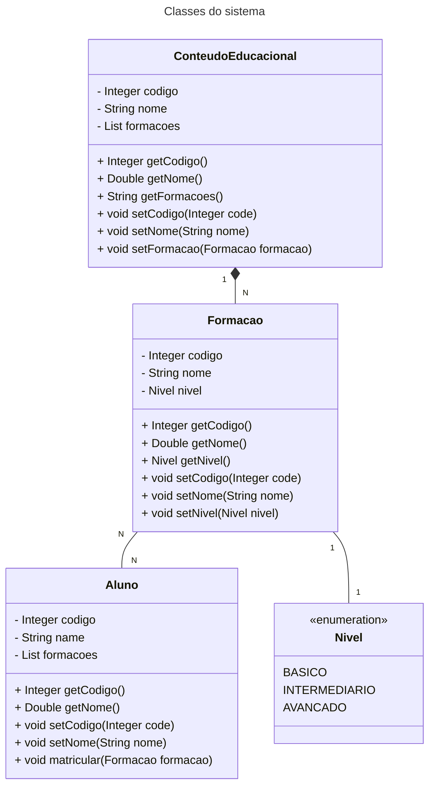

# Aprenda Kotlin Com Exemplos: Desafio de Projeto (Lab)

Desafio de Projeto criado para avaliação do conteúdo técnico explorado no repositório [aprenda-kotlin-com-exemplos](https://github.com/digitalinnovationone/aprenda-kotlin-com-exemplos). **Nesse contexto, iremos abstrair o seguinte domínio de aplicação:**

**A [DIO](https://web.dio.me) possui `Formacoes` incríveis que têm como objetivo oferecer um conjunto de `ConteudosEducacionais` voltados para uma stack tecnológica específica, preparando profissionais de TI para o mercado de trabalho. `Formacoes` possuem algumas características importantes, como `nome`, `nivel` e seus respectivos `conteudosEducacionais`. Além disso, tais experiências educacionais têm um comportamento relevante ao nosso domínio, definido pela capacidade de `matricular` um ou mais `Alunos`.**


```kotlin
TODO("Crie uma solução em Koltin abstraindo esse domínio. O arquivo [desafio.kt] te ajudará 😉")
```

# Resolução

Farei inicialmente alguns diagramas com o Mermaid:

